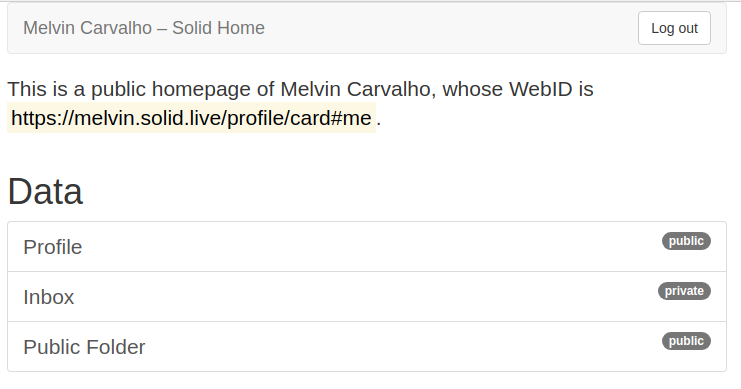
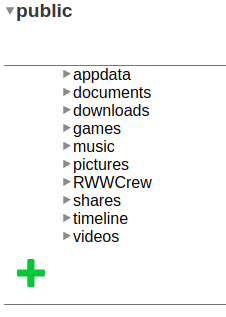
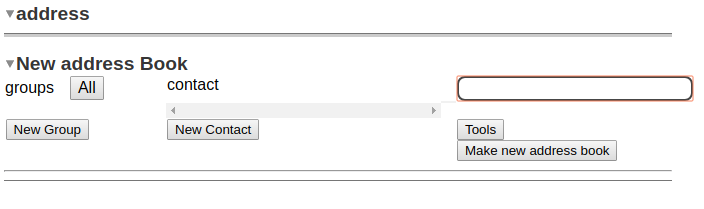
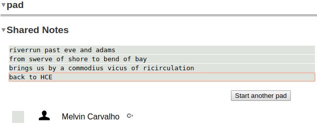
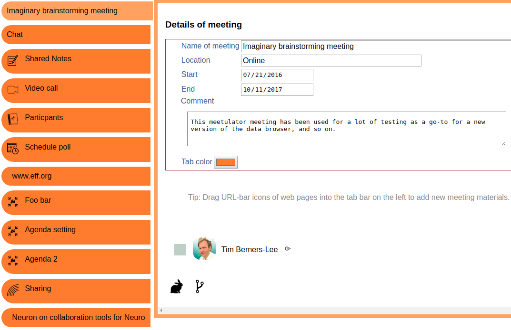
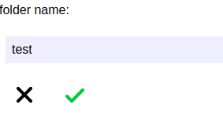
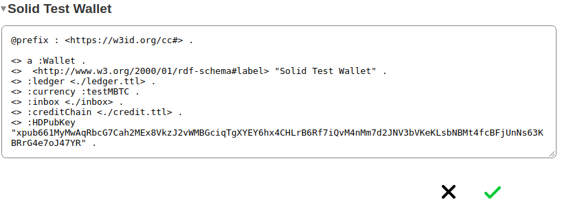

# Data Browser User Guide

## Getting Started

To get started with the data browser click the **public** folder

Click the green + and you will be able to add folders and apps.

The databrowser contains many apps.

## Address Book

Adds a list of contacts

## Pad

Gives a multi user notepad

## Chat

Creates a chat session

## Long Chat

Gives a multi day chat session

## Meeting

Creates a meeting with many addons

## Folder

Creates a new folder

## Source

Allows you to create new files, view and edit source code for files

There are many more apps and panes in the data browser.  One for each class it's also extensible and customizable, so enjoy exploring!

_Tip: drag and drop a file to the green plus and it will be uploaded to that directory_

## Deleting a file

Open your solid profile,

Navigate to and open File/Folder you want to Delete

Now, move your cursor over the name of the file or Folder. You will see some icons showing up.

Click on the 'Settings' icon

Now hover your mouse cursor to the left of the 'Refresh icon'. A red colored 'Remove' icon will become visible.

Click it & Confirm deletion.

1. Open your solid community profile,
2. Navigate to and open File/Folder you want to Delete
4. Now, move your cursor over the name of the file or Folder. You will see some icons showing up.
5.  Click on the 'Settings' icon 

6. Now hover your mouse cursor to the left of the 'Refresh icon'. A red colored 'Remove' icon will become visible. 

7. Click it & Confirm deletion.  

