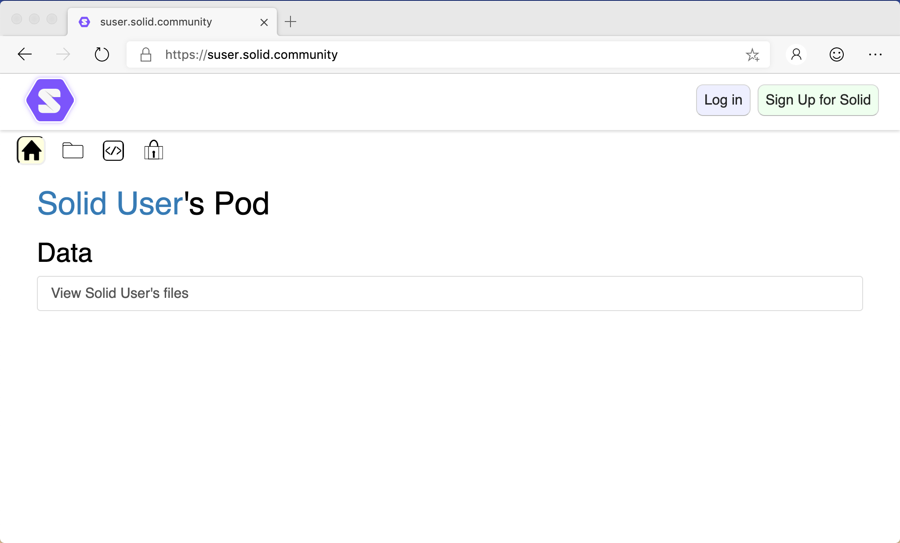
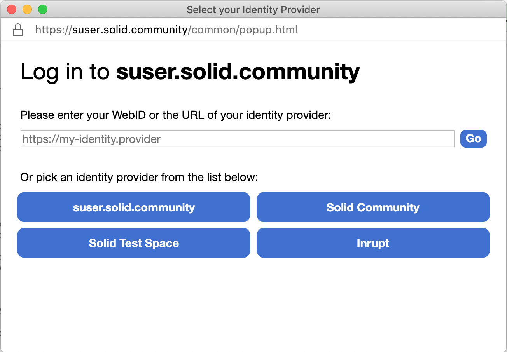
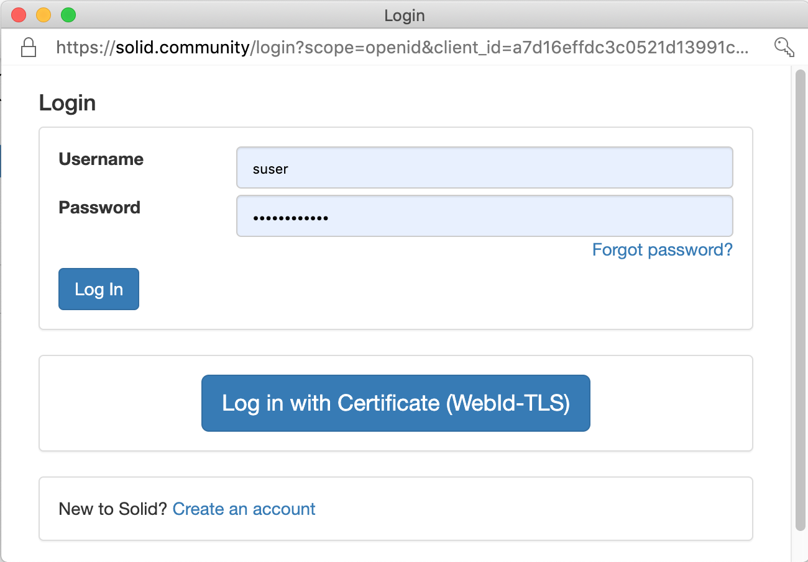
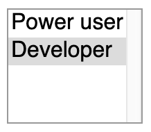

# Data Browser User Guide

- [Introduction](#introduction)
- [Accessing](#accessing)
- [Log In](#log-in)
- [Log Out](#log-out)
- [Pod Functionality](#pod-functionality)
  - [Navigation](#navigation)
  - [Viewing your Data](#viewing-your-data)
  - [Creating new Data](#creating-new-data)
  - [Deleting existing Data](#deleting-existing-data)
- [Context-Free Functionality](#context-free-functionality)
  - [Show your profile](#show-your-profile)
  - [Your stuff](#your-stuff)
  - [Preferences](#preferences)
    - [Role](#role)
    - [Manage your trusted applications](#manage-your-trusted-applications)
    - [Delete your Solid account](#delete-your-solid-account)
  - [Edit you profile](#edit-you-profile)
  - [Your storage](#your-storage)

## Introduction
[Solid](https://solid.github.io/information/) empowers users and organizations to separate their data from the applications that use it. It allows people to look at the same data with different apps at the same time. It opens brand new avenues for creativity, problem-solving, and commerce.

The [Data Browser](https://github.com/solid/mashlib) is intended to be extremely flexible and provide all the basic functionality to allow people to easily manage data on Solid, be that social core with contact management and collaborate with your friends, or the more complex use cases, such as a researcher organizing their data and research on a variety of data sources.

The Data Browser is your de-facto default interface to Solid, enabling you to create, share and collaborate on data stored within Solid Pods with your friends and contacts through social networks and applications. Using the Data Browser, you can coordinate all of your data in an interface that can be configured and extended to support all of your needs on Solid.

## Accessing
To access the data stored in a Solid Pod via the Data Browser:

1. In a web browser, navigate to the root Uniform Resource Locator (URL) for the Pod you want to access (e.g., [`https://suser.solidcommunity.net`](https://suser.solidcommunity.net)):
2. You will see a view of the public data within the Pod:

    

You can see different views of the data by clicking the various View icons just below the header. For example, the Folder view:

_**Tip:** To return to the default View, click the Solid icon in the top-left corner of the Data Browser._

_**Notes:**_
* _When viewing another person's pod, make sure to add the origin of that pod as a trusted app on your own profile._
* _When viewing another person's pod, if you want to make use of Developer or PowerUser features, you need to set your preferences file (often found at `/settings/prefs.ttl` in your pod) to be world-readable._

## Log In
To access your data, and data to which you have permission to access, you must log in:
1. Click the **Log in** button.
2. The **Select your Identity Provider** dialog is displayed:

    

3. Either enter you WebID into the textbox and click **Go**, or pick your identity provider from the list.
4. The **Login** dialog is presented prompting you to enter your Username and Password:

    

    _**Note:** The actual form of the Login dialog will vary with the version of Solid server in use._
5. After a successful login, you can [view](#viewing-your-data) of all of the data to which you have read permission within the Pod.

## Log Out
To log out of the Solid account:
1. Open the dropdown menu in the top-right corner of the Data Browser by clicking your Profile image.
2. Select **Log out**.

## Pod Functionality
You can use the Data Browser to browse and maintain the data within the Pod.

### Navigation
The Data Browser allows you to navigate through the data to which you have read access.

1. If necessary, click the Solid logo to display the  Home view.
2. Display the  Folder view.
3. The folder and data resources in the root folder are displayed as a tree.
4. Nagivate through the tree by expanding and collapsing folders and data resources.

_**Tip:** You can enter the URL for a folder or data resource in the web browser address bar to navigate directly to that resource._

### Viewing your Data
You can view the contents of any folders and/or data resources to which you have access. 

To view an existing folder or data resource:
1. [Navigate](#Navigation) to the folder containing the resource.
2. Open the resource by clicking the  icon next to the resource.
3. Depending upon the type of resource selected and your preferred [role(s)](#role), different view options can be displayed:
    * Primary Views:
        If the selected resource is of a well-known type, it will automatically be opened in that view. If not, click the appropriate icon.
        *  [Address Book](https://github.com/solid/userguide/blob/master/views/addressbook/userguide.md). List of personal contacts.
        *  [Chat](https://github.com/solid/userguide/blob/master/views/chat/userguide.md). A short chat session.
        *  [Dokieli](https://dokie.li/). Clientside editor for decentralised article publishing, annotations and social interactions.
        *  [Friends](https://github.com/solid/userguide/blob/master/views/friends/userguide.md). Maintain a list of your friends.
        *   [Issue Tracker](https://github.com/solid/issue-pane/blob/master/README.md). A flexible issue tracking system. To configure an issue tracker, follow the [configuration](https://github.com/solid/issue-pane/blob/master/Documentation/Configuration.md) instructions. 
        *  [Long Chat](https://github.com/solid/userguide/blob/master/views/longchat/userguide.md). A multi-day chat session.
        *  [Meeting](https://github.com/solid/userguide/blob/master/views/meeting/userguide.md). Meeting details.
        *  [Note Pad](https://github.com/solid/userguide/blob/master/views/notepad/userguide.md). A multi-user notepad.
        *  [Scheduled Event](https://github.com/solid/userguide/blob/master/views/scheduledevent/userguide.md).
        *  Slideshow. Display a slideshow of the images contained within the container.
    * Alternate Views:
        *  About. Display information regarding the resource.
        *  Folder. Display the resources within the container in a tree-view.
        *  [Source](https://github.com/solid/userguide/blob/master/views/source/userguide.md). Display the source of a text file.
        *  [Sharing](https://github.com/solid/userguide/blob/master/views/sharing/userguide.md). Display/update the sharing permissions for the resource.
        *  [Under the Hood](https://github.com/solid/userguide/blob/master/views/underthehood/userguide.md). Access 'under the hood' functionality regarding the resource.
    * Developer Views:
        *  Data. Display the resource using a Data view.
        *  Data as N3. Display the resource in Notation3 (N3) language. For more details on N3, click [here](https://www.w3.org/TeamSubmission/n3/).
        *  RDF/XML. Display the resource as RDF/XML.
4. Click the appropriate icon to view the resource in the desired manner.

_**Tip:** Each of the icons are toggle buttons. Click the icon again to close the view._

_**Tip:** To view a single resource in a new browser tab, click-and-drag a displayed resource name to the browser tab bar._

### Creating new Data
You can create new folders and data within any Pod folder to which you have create access.

To create a new folder or data resource:
1. [Navigate](#Navigation) to the folder in which you want to create the new resource.
2. Click the  icon for the folder.
3. Several icons are displayed showing the types of resource that can be created:
    *  [Address Book](https://github.com/solid/userguide/blob/master/views/addressbook/userguide.md). List of contacts.
    *  [Chat](https://github.com/solid/userguide/blob/master/views/chat/userguide.md). A short chat session.
    *  [Dokieli](https://dokie.li/). Clientside editor for decentralised article publishing, annotations and social interactions.
    *  Folder. A named folder.
    *  [Long Chat](https://github.com/solid/userguide/blob/master/views/longchat/userguide.md). A multi-day chat session.
    *  [Meeting](https://github.com/solid/userguide/blob/master/views/meeting/userguide.md).
    *  [Note Pad](https://github.com/solid/userguide/blob/master/views/notepad/userguide.md). A multi-user notepad.
    *  [Scheduled Event](https://github.com/solid/userguide/blob/master/views/scheduledevent/userguide.md).
    *  [Source](https://github.com/solid/userguide/blob/master/views/source/userguide.md). Create a text files (e.g., Turtle, JSON, RDF, ShEx and SHACL shapes, etc.).
4. Select the type of resource you want to create.
5. Enter the name of the new resource, and click the  Continue button.
6. The selected resource will be created in the folder.

_**Tip:** The filename extension of Dokieli documents must be `.html`._

_**Tip:** Drag and drop a file onto the  button, and it will be uploaded to that folder._

### Deleting existing Data
You can delete existing folder and data resources on which you have delete permission via the  [Under the Hood](https://github.com/solid/userguide/blob/master/views/underthehood/userguide.md) view.

## Context-Free Functionality
Via the Data Browser, you can access and maintain resources within your account, even if you have navigated to a different Pod.

To access the context-free functionality:
1. Display the dropdown menu in the top-right corner of the Data Browser by clicking your Profile photo.
2. Select the appropriate menu option.

_**Tip:** Alternatively, you can access some of the context-free functionality by clicking the Solid logo in the Data Browser header, and then click the appropriate tab._

### Show your profile
You can view your profile as other people will see it.

To view your public profile:
1. Select **Show your profile** from the dropdown menu.
2. Your public profile is displayed in the [Profile](https://github.com/solid/userguide/blob/master/views/profile/userguide.md) view.

### Your stuff
As you create resources in your Pod (e.g., address books), you can define them as private and/or public. This causes links to the resources to be displayed in the **Private things** and/or **Public things** panels to allow for easy access.

### Preferences
You can configure your Data Browser user experience by setting your [roles(s)](#Role), [manage your trusted applications](#Manage-your-trusted-applications) or even [delete your Solid account](#Delete-your-Solid-account) via the Preferences view.

To display the Preferences view:
1. Either click the Solid logo or select **Preferences** from the dropdown menu in the top-right of the Data Browser.
2. Click the **Preferences** tab.

#### Role
The options presented to you when viewing data can be customised based on your role. By default, all users can view all standard social views. Optionally, you can select one or more role(s) that provide access to advanced views in addition to the default views:
* Developer. View Data, N3, and RDF views of the data.
* Power User. View additional Data Browser views such as [Note Pad](https://github.com/solid/userguide/blob/master/views/views/notepad/userguide.md) and [Meeting](https://github.com/solid/userguide/blob/master/views/meeting/userguide.md).

To update:
1. Select your optional role(s) from the Roles listbox:

    

    _**Tip:** Multiple Roles can be selected by holding down the Shift or Command key on your keyboard._
    
2. Click off the listbox.

_**Tip:** You need to refresh your web browser for the role changes to take affect._

For more details on Roles, refer to the [User Roles](https://github.com/solid/userguide/blob/master/appendix/userroles.md) appendix.

#### Manage your trusted applications

Before you can use third-party applications, you need to whitelist them (i.e., list them as trusted to access data within your Pod) via the Trusted Application table:

##### Add
To whitelist a new third-party application, at the bottom of the table of trusted applications:
1. Enter the URL of the new application under **Application URL**.
2. Select the permissions, or **Access Modes**, you want to give to the new application.
3. Click **Add** under **Actions**.

##### Update
To update the permissions for an existing trusted application, in the table of trusted applications:
1. Update the permssions for the application.
2. Click **Update**.

##### Delete
To revoke access for an existing trusted application, in the table of trusted applications:
1. Click **Delete** next to the application.
2. The application is immediately removed from the list of trusted applications.

#### Delete your Solid account
If you no longer want your Solid Pod, you can delete your account:
1. Click the **Delete your account** link at the bottom of the Preferences page.
2. You are redirected to the Delete Account page for the Solid server.
3. Follow the displayed instructions to delete your account.

_**Note:** The actual workflow for deleting your account depends upon the Solid server you are using. For example, [Node Solid Server (NSS)](https://github.com/solid/node-solid-server/blob/master/docs/how-to-delete-your-account.md)._

_**Warning:** When your account is deleted, all of the data is deleted and cannot be restored._

### Edit you profile
You can setup a public profile that will be visible to visitors to your Pod.

To edit your public profile:
1. Select **Edit your profile** from the dropdown menu.
2. In the Profile page, enter/select:
    * One or more Profile photos by dragging-and-dropping a image file onto the photo panel.
    * Contact information about yourself that you want to make public. You can add multiple Addresses, Phones, and Emails.
    * Public contacts by dragging-and-dropping WebIDs of those contacts onto the target icon.
    * The background and highlight colors in which your public profile should be displayed.

### Your storage
Even if you have navigated to a different Pod, you can still view your storage.

To view your storage:
1. Select **Your storage** from the dropdown menu.
2. A Folder view of your storage is displayed.
