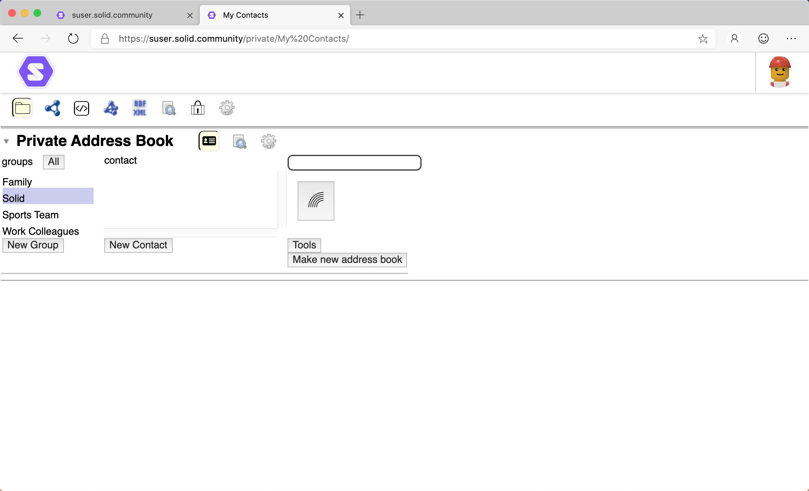
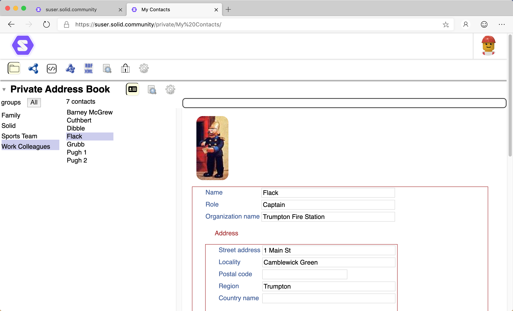
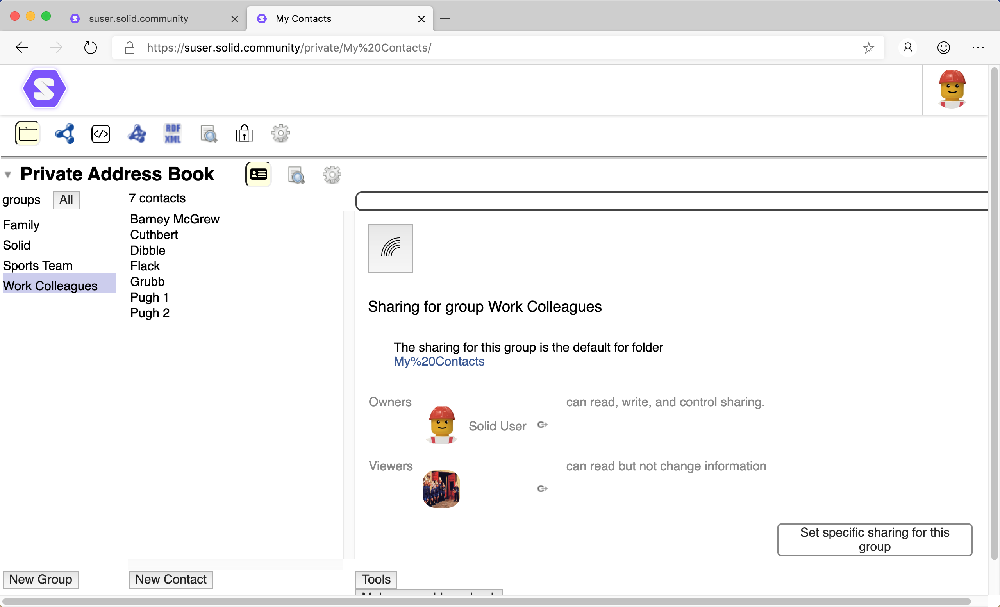

# Address Book User Guide

- [Introduction](#introduction)
- [View](#view)
- [Contacts ](#contacts-)
  - [Search Contacts](#search-contacts)
  - [Display a Contact](#display-a-contact)
  - [Add a new Contact](#add-a-new-contact)
  - [Delete an existing Contact](#delete-an-existing-contact)
- [Groups](#groups)
  - [New Group](#new-group)
  - [Delete Group](#delete-group)
  - [Group Sharing](#group-sharing)
    - [Add](#add)
    - [Adjust](#adjust)
    - [Remove](#remove)
- [Tools](#tools)

## Introduction

The Address Book view allows you to maintain your contacts, including grouping them together.

## View
To display an address book:
1. In the [Data Browser](https://github.com/solidos/userguide/README.md), navigate to the address book. 
2. The address book should automatically be displayed:

_**Tip:** If the address book is not automatically displayed, click  in the address book header._

## Contacts

### Display a Contact
To display the details for a contact:
1. Optionally, select the [group](#groups)(s) of which the contact is a member to filter the list of contacts.
1. Click the name of the contact to display.
2. The details of the contact are displayed in a [Profile](https://github.com/solidos/userguide/blob/master/views/profile/userguide.md) view:

3. Via the [Profile](https://github.com/solidos/userguide/blob/master/views/profile/userguide.md) view, you can edit the contact details.

_**Tip:** To select all groups, click the **All** button. To select a subset of the groups, click the group name while holding the Shift/Command key._

### Search
You can search for contacts within the address book:
1. Enter the search term in the search bar at the top of the Address Book view.
2. The names of any contacts, in the selected groups, that match the search term are listed.

### Add a new Contact
To create a new contact record:

1. Select the group(s) into which the new contact should be appended.
2. Click the **New Contact** button.
2. Enter the name for the new Contact.
3. Click  Continue icon to create the Contact.
4. A [Profile](https://github.com/solidos/userguide/blob/master/views/profile/userguide.md) view for the new Contact is displayed allowing the details to be entered.

_Note: A contact must be a member of at least one group._

### Delete an existing Contact
To delete an existing contact:

1. [Display](#display-a-contact) the details for the contact.
2. At the bottom of the [Profile](https://github.com/solidos/userguide/blob/master/views/profile/userguide.md), hover the mouse pointer over the profile.
3. A  Remove icon is displayed. 
4. Click the  Remove icon to delete the contact. 

## Groups
Contacts can be assembled into groups. A single contact may be a member of multiple groups.

### New Group
New contact groups can be created:

1. Click the **New Group** button.
2. Enter the name for the new group.
3. Click  Continue icon to create the group.

### Delete Group
To delete an existing group:

1. Hover the mouse cursor over the Group name.
2. A  Remove icon is displayed. 
3. Click the  Remove icon to delete the group. 

### Group Sharing
Individual groups can be shared differently than the whole address book.

To adjust the sharing:
1. Select the group to adjust.
2. Click the displayed  Sharing icon.
3. The Sharing settings for the group are displayed:

4. To set custom sharing for this group:
    1. Click the **Set specific sharing for the group** button.
    2. This causes the sharing groups (Owners, Editors, Posters, Submitters, Viewers) for the group to be displayed.
    3. Permissions for users can be [added](#add), [adjusted](#adjust), and/or [removed](#remove).
5. To reset sharing for this group back to the default:
    1. Click the **Stop specific sharing for this group** button. 

#### Add
To add a user/group/bot as Viewers:
1. Click the  Add icon.
2. Icons are displayed for each of the entities that can be given access to the resource:
    *  User.
    *  Group.
    *  Everyone.
    *  Authenticated Agent.
    *  Bot.
    *  Trusted Applications.
3. Select the entity type for which you want to provide access.
    * If a  User,  Group or  Bot is selected to be added:
        1. A text box is displayed allowing the URI for the entity to be entered.
        2. Enter the URI for the entity and click  Continue.
        3. The entered entity is added as a Viewer.
    * If  Everyone or  Authenticated Agent is selected:
        1. Everyone or Authenticated Agent is immediately added as a Viewer.
    * If  Trusted Applications is selected:
        1. A list of your trusted applications is displayed.
        2. Select the Trusted Applications you want to give access.
        3. The selected Trusted Applications are added as Viewers.
4. Once added, the sharing access of the entity can be [adjusted](#Adjust).

_**Tip:** To add a entity to a specific sharing group, drag-and-drop the URI for the entity onto the sharing group._

#### Adjust
To move an entity between sharing groups:
1. Click-and-drag the entity between the sharing groups.

#### Remove
To remove an entity from a sharing group:
1. Hover the mouse pointer over the  Goto This icon next to the user's Profile image/name.
2. A  Remove icon is displayed. 
3. Click the  Remove icon to remove the sharing access for the entity.

## Tools

The various Address Book tools allow you to review and maintain the address book.

* Sharing for the Address Book. Allows the [sharing](https://github.com/solidos/userguide/blob/master/views/sharing/userguide.md) for the address book to be views and modified.
* **Check Individual Card Access for Selected Groups**. Who can access which groups?
* **Find Duplicate Cards**. Scans the contacts to determine any duplicate records. If any are found, they can be repaired.
* **Find Individuals with no Group**. Determines if any contacts are not in any group.
* **Public Link to this Address Book**. Generates a public link to the address book that is displayed in the **Public things** panel under **Your stuff** on your Dashboard.
* **Personal Note of this Address Book**. Generates a private link to the address book that is displayed in the **Private things** panel under **Your stuff** on your Dashboard.
* **Load Main Index**. Reloads the main people index.
* **Statistics**. Generates statistics for the address book.
