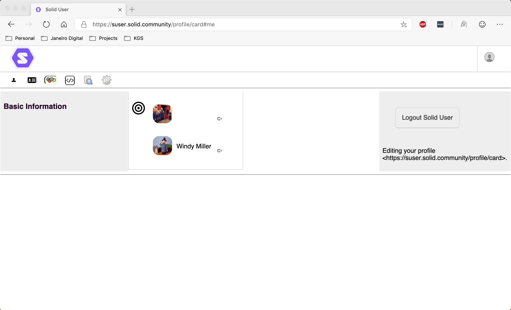
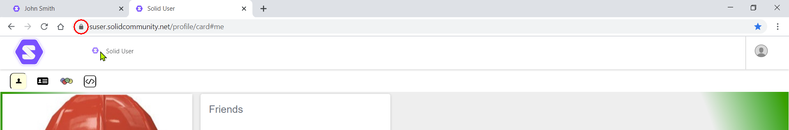

#  Friends User Guide
If you want to view your friends or add someone as a friend to your profile, using the `foaf:knows` predicate, you can use the [Friends](https://github.com/solid/userguide/blob/master/views/friends/userguide.md) view:

## View
To display your friends:
1. In the [Data Browser](https://github.com/solid/userguide/README.md), select **Show your profile** in the top-right dropdown menu. Your profile is displayed.
2. Click the  Friends icon.

The view displays a list of your existing friends.

## Display a Friends Profile
To display the public profile for an existing friend:

1. Click the  Goto This icon next to the user's Profile image/name.
2. The selected friend's public profile will open in a new tab.

## Add a new Friend
To add a new frield to the list:

1. Display the profile of your friend in a new web browser tab.
2. Click-and-drag the icon displayed to the left of the WebID in the web browser address bar onto the Friends list:

3. If valid, the friend is added to the list.

_**Tip:** Make sure to use the whole WebID of the friend you are adding, including the `#me` or other fragment identifier._

## Remove an existing Friend
To remove an existing friend:
1. Hover the mouse pointer over the  Goto This icon next to the user's Profile image/name.
2. A  Remove icon is displayed. 
3. Click the  Remove icon to remove the the friends WebID from the list.
