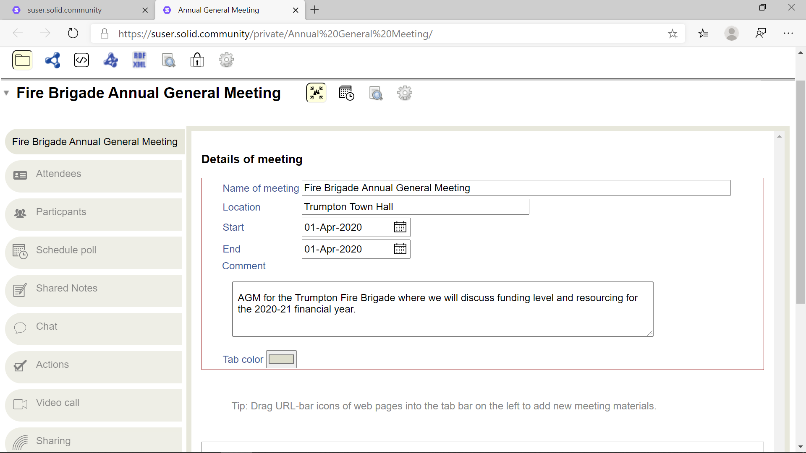

# Meeting View User Guide

- [Introduction](#introduction)
- [View](#view)
- [Attendees](#attendees)
- [Add Tools](#add-tools)

## Introduction
The Meeting view, also known as Meetulater, allows you to schedule a meeting with multiple attendees, and capture information related to the meeting.

## View
To view an existing meeting:
1. In the [Data Browser](https://github.com/solid/userguide/README.md), navigate to and click on the meeting.
3. If valid, the meeting details are displayed in a Meeting view:

Each meeting can have:
- A title.
- A location.
- Start and end dates.
- General meeting comments.
- Optional set of tools for capturing additional meeting details.

Additionally, you can:
- Set the background colour of the tabs.
- Create a **Public link to this meeting**. If selected, a link to the meeting is shown on under **Public Things** on your Dashboard.
- Include a **Personal note of this meeting**.

_**Tip:** If you have edit permissions to the meeting, any edits you make are immediately saved._

## Attendees
Attendees can be added to the meeting. To invite the first attendee:
1. Highlight a WebID.
2. Drag-and-drop the WebID onto the meeting tab bar.
3. An **Attendees** tab will be created.

To invite more attendees:
1. Make sure the **Attendees** tab is active.
2. The list of existing meeting attendees is displayed in an [Address Book](https://github.com/solid/userguide/blob/master/views/addressbook/userguide.md) group.
2. Highlight a WebID.
3. Drag-and-drop the WebID onto the tab bar.
4. The new attendee will be added to the meeting.

_**Tip**: You may need to refresh the web page to see new meeting attendees._

## Add Tools
In addition to the basic meeting information and tools, you can add more tools to the meeting to capture additional details:
1. Click the  icon below the displayed meeting.
2. Several icons are displayed showing the tools that can be added:
    -  Participants. Lists everyone who has joined the meeting.
    -  Schedule Poll. Setup a poll of users on when to schedule another meeting.
    -  Agenda. Setup a meeting agenda. _**Note:** This functionality is currently disabled._
    -  Shared Notes. A shared multi-user [Note Pad](https://github.com/solid/userguide/blob/master/views/views/notepad/userguide.md).
    -  [Chat](https://github.com/solid/userguide/blob/master/views/chat/userguide.md). A short chat session. 
    -  Actions. [Issue Tracker](https://github.com/solid/issue-pane/blob/master/README.md) to track issues and action itens.
    -  Video Call. Conduct a video call for the meeting. _**Note:** The availability of this functionality is dependent upon your web browser [iFrame](https://www.w3.org/TR/2011/WD-html5-20110525/the-iframe-element.html#the-iframe-element) rules and camera permissions._
    -  [Sharing](https://github.com/solid/userguide/blob/master/views/sharing/userguide.md). Display/update the sharing permissions for the meeting.
    -  Meeting. Setup another meeting.
3. Click the appropriate icon for the tool you want to add.
4. If appropriate, a new tab for the selected tool is added to the tab bar for the meeting.
5. Click on the tool tab to activate/display the tool.

## Add Meeting Materials
For reference, meeting materials available via a URL can be added to the meeting:
1. Highlight the web page URL for the material.
2. Drag-and-drop the URL onto the tab bar.
3. If appropriate, a new tab for the material is added to the tab bar for the meeting.
4. Click on the appropriate materials tab to display the material.
5. Where possible, the material is displayed in an [iFrame](https://www.w3.org/TR/2011/WD-html5-20110525/the-iframe-element.html#the-iframe-element) within your web browser. _**Note:** To resize the iFrame containing the material, use the resizing bar in the bottom-right corner of the iFrame._