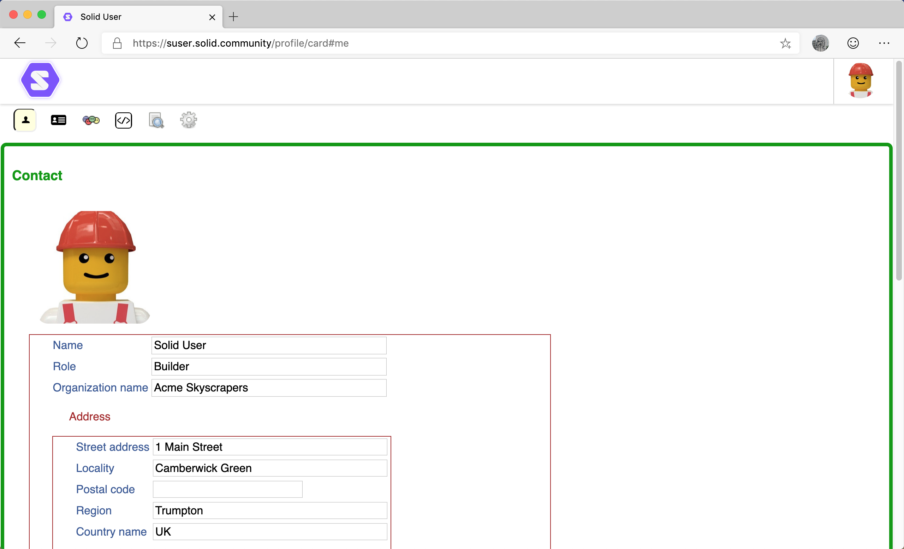
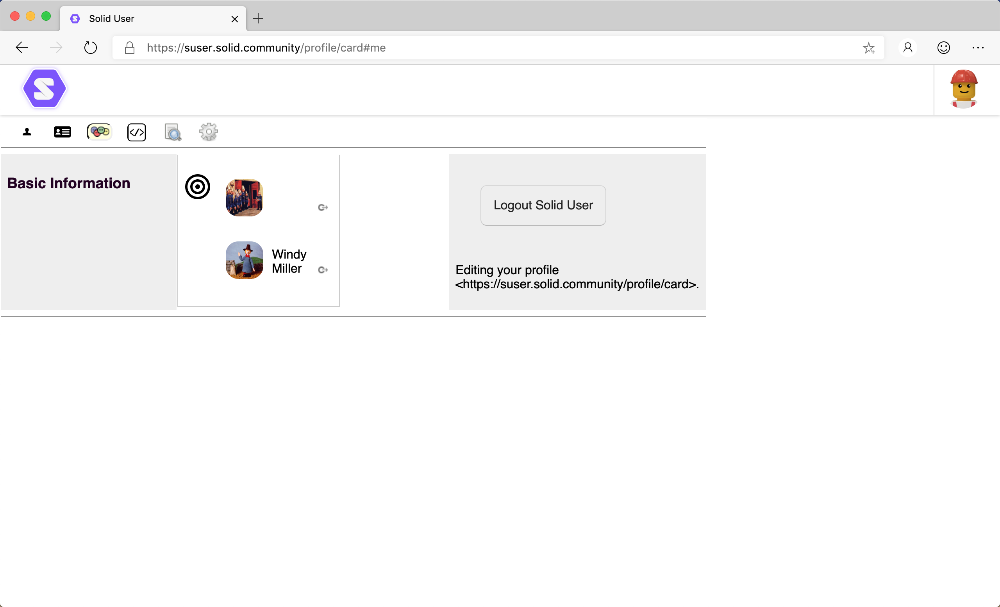

# Profile User Guide

- [Introduction](#introduction)
- [Friends](#friends)
   - [Add public Friends](#add-public-friends)
   - [Remove public Friends](#remove-public-friends)

## Introduction
The Profile view displays the public Profile for the entered WebID and lists their public friends.

   

Several icons are displayed:

*  About. Display information regarding the Profile.
*  Display the Contact view of the Profile.
*  Display the Person view of the Profile.
*  Display public friends together with a link allowing the Profile to be view as a basic data resource.
*  [Source](https://github.com/solid/userguide/blob/master/views/source/userguide.md). Display the source of the Profile.
*  [Under the Hood](https://github.com/solid/userguide/blob/master/views/underthehood/userguide.md). Access 'under the hood' functionality regarding the resource.

_Tip: If you have edit permission to the Profile, you can edit the Profile in both the Contact and Person views._

## Friends
Any public friends of the WebID of displayed on the Friends view, together with a link allowing the Profile to be view as a basic data resource:

   

### Add public Friends
If you have edit permission to the Profile, you can add more public Friends by dragging a WebID onto the Basic Information  target.

### Remove public Friends
If you have edit permission to the Profile, you can remove public Friends by:

1. Hover the mouse pointer over the  Goto This icon next to the friends's Profile image/name.
2. A  Remove icon is displayed. 
3. Click the  Remove icon to remove the friend.
