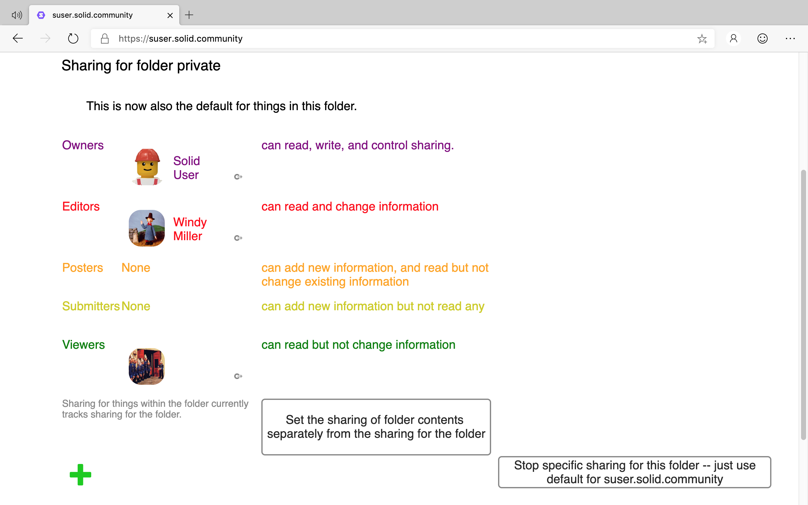

# Sharing View User Guide

- [Introduction](#introduction)
- [View](#view)
- [Specific Sharing for a Resource](#specific-sharing-for-a-resource)
- [Custom Sharing](#custom-sharing)
  - [Add](#add)
  - [Adjust](#adjust)
  - [Remove](#remove)
  
## Introduction
Solid allows you to control who can access folders and data resources within your Pod, and what permission they have — i.e., read, create, update, and/or delete. 

## View
To display the Sharing view for a folder or data resource:
1. In the [Data Browser](https://github.com/solid/userguide/README.md), navigate to the resource.
2. Select the  Sharing view.
3. The Sharing settings for the selected resource are displayed:

For each of the Sharing groups - Owners, Editors, Posters, Submitters, Viewers, the Sharing view displays the group members and the assigned permissions.

_**Tip:** Clicking the  Goto icon next to the user's Profile image/name will display the user's profile._

## Specific Sharing for a Resource
By default, resources within a folder inherit the permissions from the parent folder. 

To set specific sharing for the resource:
1. Click the **Set the sharing of folder contents separately from the sharing for the folder** button.
2. This causes the sharing groups (Owners, Editors, Posters, Submitters, Viewers) for the specific resource to be displayed.

To reset the sharing for the resource back to the default:
1. Click the **Stop specific sharing for this folder/file** button.

## Custom Sharing
The sharing permissions for a given resource can be updated to provide access to specific users, groups, bots, authenticated agents, trusted applications, or even everyone.

### Add
To add a user/group/bot as Viewers:
1. Click the  Add icon.
2. Icons are displayed for each of the entities that can be given access to the resource:
    *  User.
    *  Group.
    *  Everyone.
    *  Authenticated Agent.
    *  Bot.
    *  Trusted Applications.
3. Select the entity type for which you want to provide access.
    * If a  User,  Group or  Bot is selected to be added:
        1. A text box is displayed allowing the URI for the entity to be entered.
        2. Enter the URI for the entity and click  Continue.
        3. The entered entity is added as a Viewer.
    * If  Everyone or  Authenticated Agent is selected:
        1. Everyone or Authenticated Agent is immediately added as a Viewer.
    * If  Trusted Applications is selected:
        1. A list of your trusted applications is displayed.
        2. Select the Trusted Applications you want to give access.
        3. The selected Trusted Applications are added as Viewers.
4. Once added, the sharing access of the entity can be [adjusted](#Adjust).

_**Tip:**_ 

To add an entity directly to a specific sharing group, either:
* Click-and-drag the URI for the entity onto the sharing group; or,
* Enter and display the URI for the entity in a new browser tab, and then click-and-drag the icon displayed to the left of the URI in the web browser address bar onto the sharing group:

### Adjust
To move an entity between sharing groups:
1. Click-and-drag the entity between the sharing groups.

### Remove
To remove an entity from a sharing group:
1. Hover the mouse pointer over the  Goto This icon next to the user's Profile image/name.
2. A  Remove icon is displayed. 
3. Click the  Remove icon to remove the sharing access for the entity.
