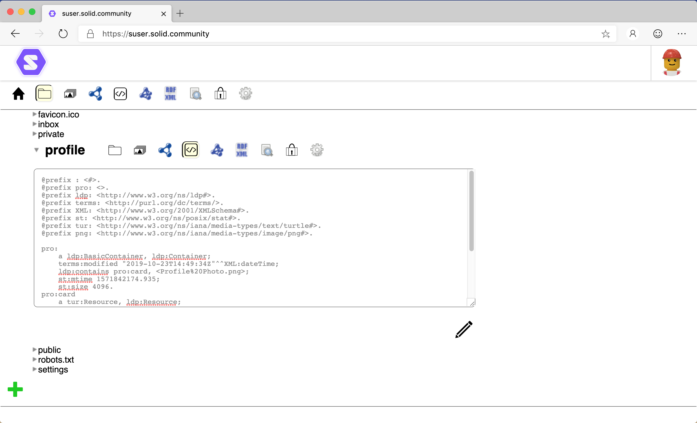

# Source View User Guide

The source of data resources (e.g., Turtle, HTML, etc.) can be viewed and edited via the Source view. 

## View
To display the Source view for a folder or data resource:
1. In the [Data Browser](https://github.com/solid/userguide/README.md), navigate to the resource.
2. Select the  Source view.
3. The source for the selected resource is displayed:

## Edit
To edit the displayed source:
1. Click  below the Source view panel.

## Save / Cancel
To save edits to the source:
1. Click  below the Source view panel.
2. Based on the type of data resource being edited, the source will be syntax checked and: 
    1. If valid, the resource will be saved. 
    2. Otherwise, an error message is displayed describing the issue. The issue will need to be corrected before the resource can be saved.

_Tip: To cancel and discard any edits, click  below the Source view panel._

_Tip: You need write access to the data resource to save edits._
