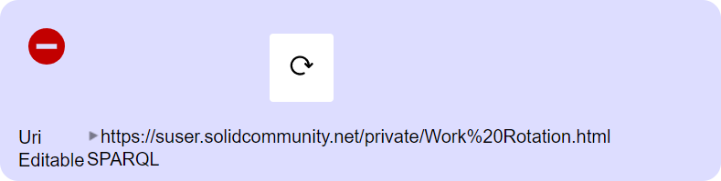

# Under the Hood View User Guide

## Introduction

The Under the Hood view displays information about the resource that may be of interest, including the URL to the resource and how it could be directly edited. Addtionally, you can delete the resource if you have permission to do so.

## Prerequisite

To have the privileges to manipulate your own resources you have to: 
1. Login
2. Click on your profile image. A menu unfolds.
3. Click on _Preferences_. 
4. Select _Power user_ **and** _Developer_ under **User types**.

## Deleting the Resource
You can delete existing folder and data resources to which you have delete permission.

To delete an existing data resource:
1. Navigate to and open the resource you want to delete.
2. Click on the  Under the Hood icon.
3. In the displayed panel, hover your mouse cursor to the left of the  Refresh icon. A  Remove icon will become visible:
4. Click the  Remove  icon to delete the resource.
5. Confirm the deletion by clicking the **Delete file** button.

_**Tip:** You need to refresh your web browser for the deletion to be visible in the Folder view._
